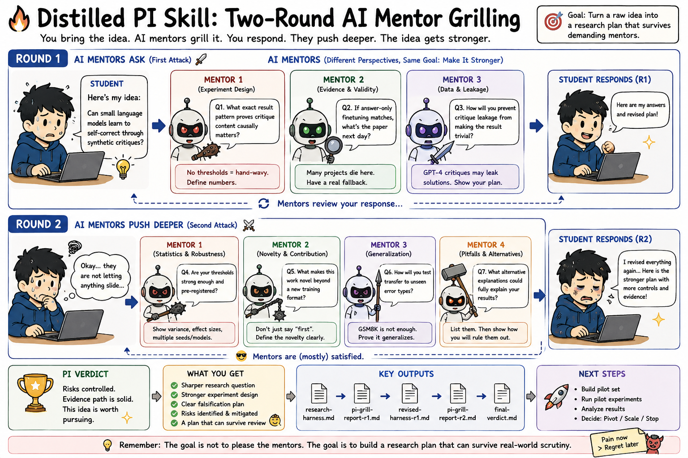
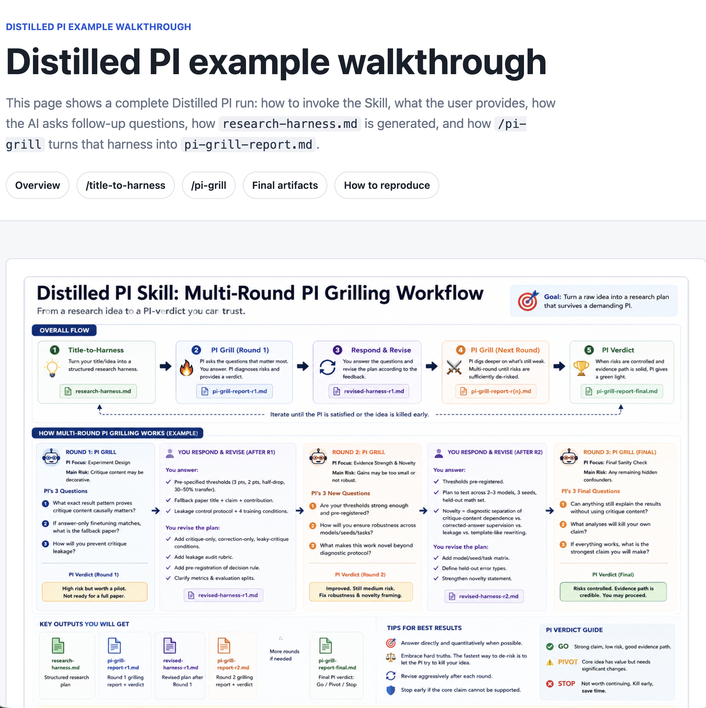

# Distilled PI

**Chinese name:** 导师拷打器

<p align="center">
  <a href="https://jy00295005.github.io/distilled-pi/docs/distilled-pi-example-walkthrough.html">
    
  </a>
</p>

Distilled PI is an Agent Skill for sharpening research ideas before they enter a real group meeting, advisor discussion, proposal, or paper draft. It is packaged first for OpenAI Codex / ChatGPT-style Skills, and also includes a Claude Code adapter.

It is built for PhD students, research newcomers, and junior faculty who need more than encouragement. The Skill asks a small number of hard questions, forces assumptions into the open, and helps turn vague research ideas into defensible research plans.

## Why This Exists

This project is inspired by my own research training with my strict advisor, **Prof. Xiaolin Zhang**.

During my PhD, group meetings were not just status updates. They were where research ideas were tested under pressure: unclear claims were exposed, weak experimental plans were challenged, and vague intuitions had to become precise research questions. At the time, that pressure was demanding. In retrospect, it was one of the most useful parts of learning how to think like a researcher.

Distilled PI is my attempt to distill that experience into a reusable Agent Skill.

The goal is not to imitate a person, and not to create an adversarial chatbot. The goal is to preserve the useful part of a rigorous PI meeting: concise critique, high standards, and concrete repair paths.

## What It Does

Distilled PI supports two slash-style workflows:

- `/title-to-harness`
- `/pi-grill`

Together, they form a research-preparation loop:

```text
rough title or idea
-> structured research harness
-> PI-style stress test
-> repaired claim, experiment plan, and next actions
```

The Skill is intentionally skeptical but helpful:

- few questions, but hard questions;
- no generic encouragement;
- explicit assumptions, risks, and unknowns;
- preference for falsifiable claims;
- critique first, repair second.

## Platform Support

Distilled PI is designed as a portable `SKILL.md` workflow.

- **OpenAI Codex / ChatGPT-style Skills:** use the canonical implementation in [`skill/`](skill/), with UI metadata in [`skill/agents/openai.yaml`](skill/agents/openai.yaml).
- **Claude Code:** use the project-level adapter in [`.claude/skills/distilled-pi/SKILL.md`](.claude/skills/distilled-pi/SKILL.md), plus slash command wrappers in [`.claude/commands/`](.claude/commands/).

The core instructions live in one place: [`skill/SKILL.md`](skill/SKILL.md) and [`skill/references/`](skill/references/). Platform-specific files are thin adapters so the Codex and Claude versions do not drift apart.

### Codex Usage

```text
Use $distilled-pi

/title-to-harness
Title:
...
```

Then run:

```text
Use $distilled-pi

/pi-grill
<paste research-harness.md>
```

### Claude Code Usage

When this repository is opened in Claude Code, the project-level files under `.claude/` expose the same workflows:

```text
/title-to-harness
Title:
...
```

Then run:

```text
/pi-grill
<paste research-harness.md>
```

Claude should treat the files under `skill/` as the canonical source of truth and use the `.claude/` files only as routing wrappers.

## Demo Walkthrough

See the full rendered example walkthrough:

[`distilled-pi-example-walkthrough.html`](https://jy00295005.github.io/distilled-pi/docs/distilled-pi-example-walkthrough.html)

<p align="center">
  <a href="https://jy00295005.github.io/distilled-pi/docs/distilled-pi-example-walkthrough.html">
    
  </a>
</p>

The walkthrough shows the complete flow from `/title-to-harness` to `/pi-grill`: user input, AI questions, user answers, generated `research-harness.md`, final `pi-grill-report.md`, risk heatmap, and PI verdict.

## Who It Is For

Distilled PI is designed for:

- PhD students preparing for group meetings, proposal defenses, or paper planning;
- early-stage researchers turning a loose topic into a researchable question;
- junior faculty preparing paper pitches, grant ideas, or student feedback;
- research teams that want a repeatable pre-review ritual before investing in writing or experiments.

## Workflow 1: `/title-to-harness`

Use `/title-to-harness` when you only have a research title, a rough idea, or a few sentences of background.

Example input:

```text
/title-to-harness

Title:
Can Small Language Models Learn to Self-Correct Through Synthetic Critiques?

Optional context:
I want to test 1B-3B models on math reasoning. I worry they may only imitate critique style.
```

The Skill first performs **Title Triage**. It decides what kind of research artifact the title most likely points to:

- Research Paper
- Survey / Review
- Benchmark
- Dataset
- System
- Position / Perspective
- Unclear / Hybrid

Then it runs a short intake process:

1. Ask broad questions based on the title type.
2. Check answer quality across problem clarity, scope, claim, novelty, evidence, falsification, and risk.
3. Ask one targeted follow-up round only if necessary.
4. If the user cannot answer, provide plausible candidate assumptions and recommend a safe default.
5. Generate a structured Markdown harness.

Possible outputs:

- `research-harness.md`
- `survey-harness.md`
- `benchmark-harness.md`
- `dataset-harness.md`
- `system-harness.md`
- `position-harness.md`

The harness is meant to be useful for both humans and downstream AI research agents. It makes the idea inspectable: what is being claimed, why it matters, what evidence is needed, what could falsify it, and what should be asked in the next PI meeting.

## Workflow 2: `/pi-grill`

Use `/pi-grill` after you have a harness generated by `/title-to-harness`.

Example input:

```text
/pi-grill

Required:
<paste research-harness.md>

Optional abstract:
We investigate whether small language models can learn to self-correct through synthetic critiques...
```

The harness is required. Abstracts, proposals, drafts, experiment plans, slides, notes, or PDFs can be added, but they are only supporting evidence. The harness remains the source of truth.

The Skill then simulates a concise PI-style research meeting:

1. Parse the harness and optional materials.
2. Diagnose the meeting stage: harness, proposal, experiment design, preliminary results, draft paper, or rebuttal.
3. Ask only the most dangerous 2-3 questions.
4. Stress-test the user's answers.
5. Ask 1-2 targeted follow-up questions only if needed.
6. Generate `pi-grill-report.md`.

The final report identifies:

- the PI's main concern;
- the weakest claim;
- a safer claim;
- novelty risk;
- experiment and evidence risk;
- baseline gaps;
- alternative explanations;
- what to fix before the next meeting;
- a concrete 7-day plan;
- context for future AI research work.

## Example Output Artifacts

See:

- [Rendered demo walkthrough](https://jy00295005.github.io/distilled-pi/docs/distilled-pi-example-walkthrough.html)
- [`docs/distilled-pi-example-walkthrough.html`](docs/distilled-pi-example-walkthrough.html)
- [`examples/example-title.md`](examples/example-title.md)
- [`examples/example-research-harness.md`](examples/example-research-harness.md)
- [`examples/example-pi-grill-report.md`](examples/example-pi-grill-report.md)

## Repository Structure

```text
distilled-pi/
├── design/                  # Source design documents
├── docs/                    # Product-level documentation
├── examples/                # Example inputs and output artifacts
├── .claude/                 # Claude Code project adapter and slash commands
└── skill/                   # Canonical Agent Skill implementation
    ├── SKILL.md             # Skill entry point and workflow router
    ├── agents/openai.yaml   # OpenAI/Codex UI metadata
    └── references/          # Detailed workflow instructions
```

## Current Status

The first functional Skill implementation is available under [`skill/`](skill/). Claude Code support is provided through [`.claude/`](.claude/) without duplicating the core workflow instructions.

The original workflow designs are in [`design/`](design/), and the operational instructions used by the Skill are in [`skill/references/`](skill/references/).

## License

MIT License.
